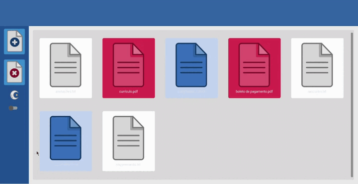
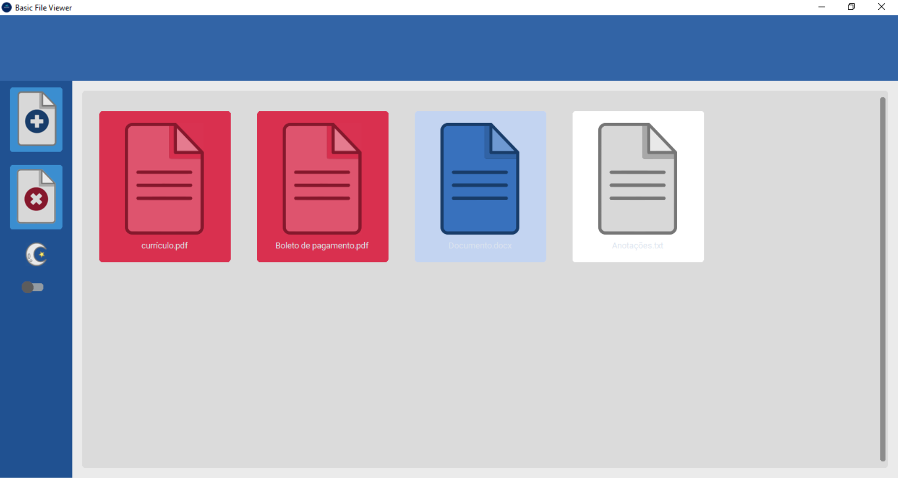
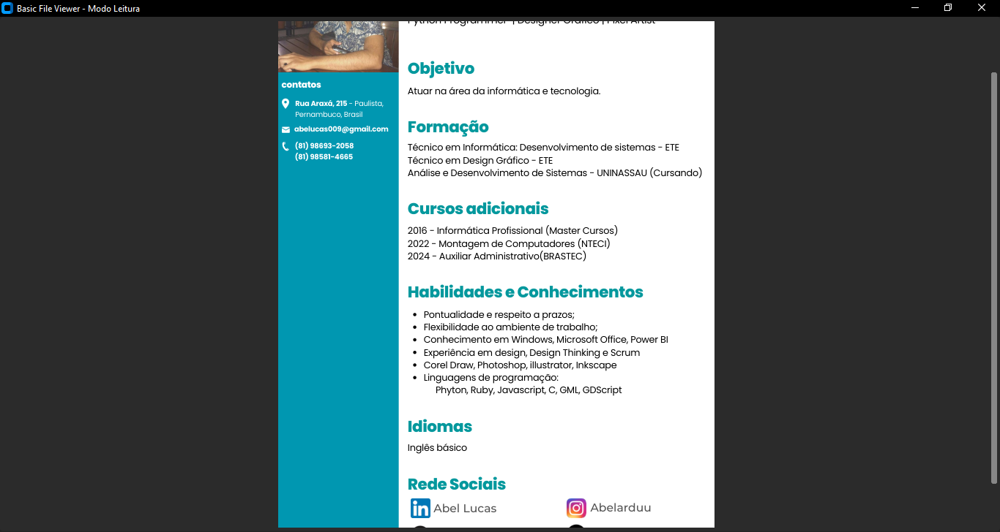

# Basic-File-Viewer

### Sobre o projeto
🚧⚠️ **Em desenvolvimento...** ⚠️🚧

O Basic File Viewer é um aplicativo simples e direto para visualização de arquivos. Com uma boa interface, prática e acessível, oferece uma experiência agradável para o usuário.O Basic File Viewer suporta a visualização de arquivos PDF, DOC e TXT, proporcionando uma interface intuitiva e eficiente, complementada por um banco de dados integrado para gerenciar facilmente esses tipos de arquivos. Desenvolvido em Python com CustomTkinter e SQLite3.

### Resultado
 

